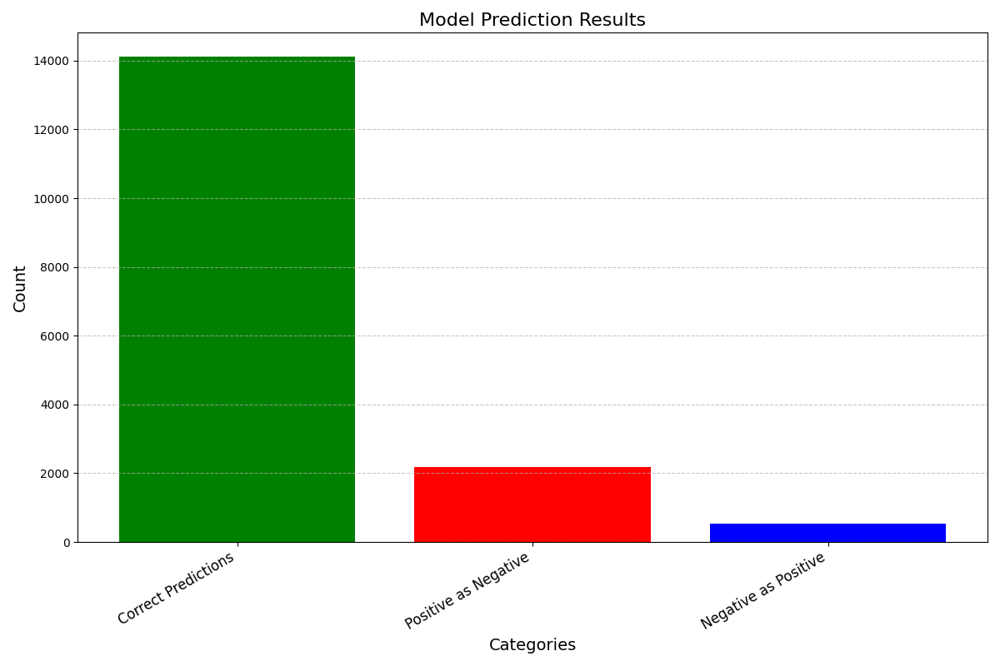
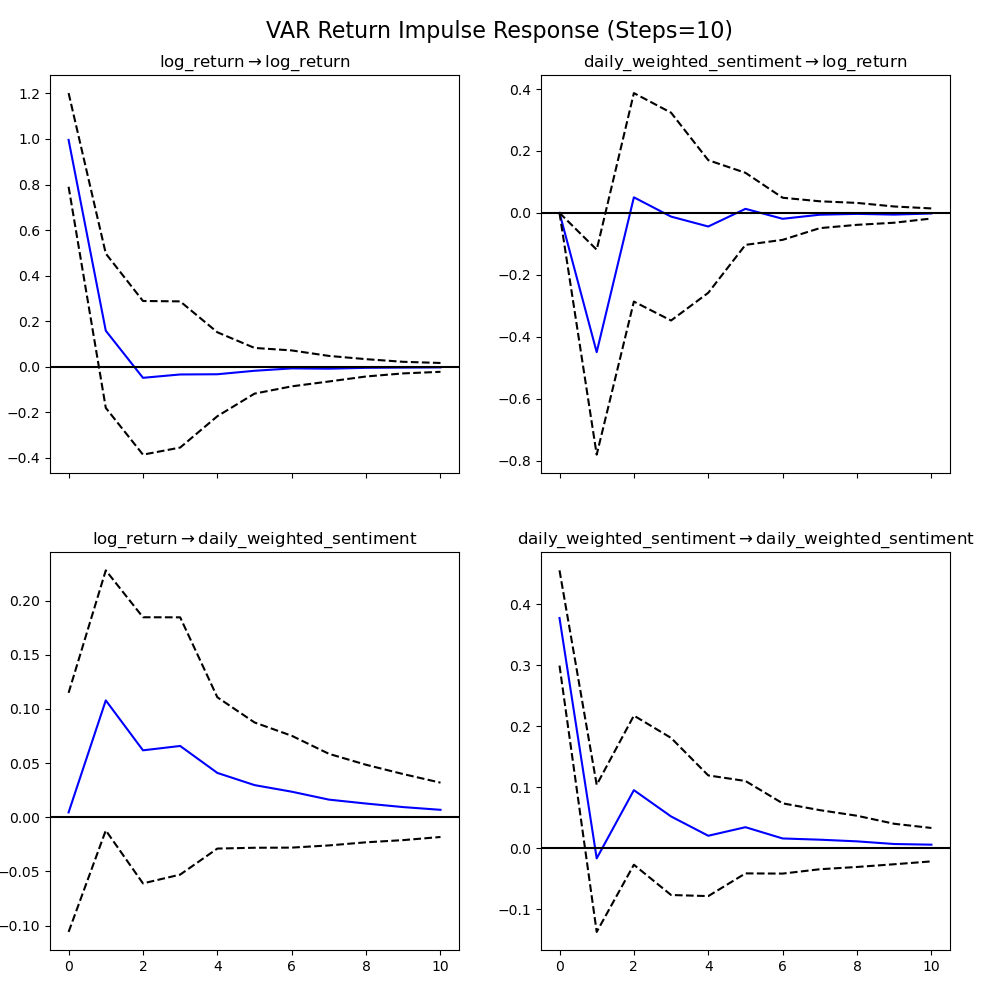
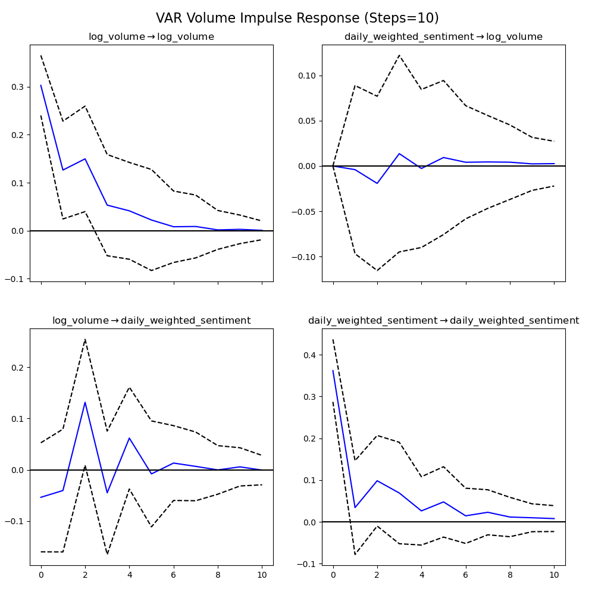

  
# How do Public Sentiments Affect Stock Metrics?

**11 December 2024**  
<i>Python, Big Data, and Databases (ECO395m)</i>

**404 NotFound: Rongzheng Ma, Siyi Li, Sherry Chen**

---

## Introduction

The goal of this project is to analyze how public sentiments potentially affect the Dow Jones Index (DJI) and the stock return and volume of companies within the index. Public sentiment data was gathered from comments on an open online forum, StockTwits. By performing time-series regression analysis, we aim to better understand how sentiment scores derived from StockTwits can predict future stock movements.

## Data Source

Comments: StockTwits(https://stocktwits.com/)

Financial data: Yahoo Finance(https://finance.yahoo.com/)

## Methodology

We scraped comments and their respective metadata (such as the number of likes and shares) for 30 companies in the Dow Jones Index from the StockTwits forum using Python's Selenium package. Due to the large volume of data, we leveraged Google Cloud Platform (GCP) servers to assist with the scraping process. After collecting the data, we stored the posts in an SQL database and used SQLAlchemy to manage the database, and then we used a pre-trained model from the Hugging Face community for sentiment analysis (https://huggingface.co/cardiffnlp/twitter-roberta-base-sentiment-latest).

1. Stocktwit Comments: We collected 85,775 posts from the 30 companies in the Dow Jones Index. The number of comments per company varied, and the final comment dates scraped for each company were inconsistent due to the stopping points of the scraping process. All comments were directly pushed to the database. A detailed summary of the number of comments and the final comment dates is provided below and in the artifact folder.

2. Sentiment Scores: Once the comments were collected, we performed sentiment analysis using a pre-trained model from the Hugging Face community. Following the methodology of Antweiler and Frank's article "Is All That Talk Just Noise? The Information Content of Internet Stock Message Boards", we incorporated an influence variable calculated based on the number of responses, likes, and shares. This variable was then used to construct a daily investor sentiment index for each stock.

Bt = (Mtpos - Mtneg) / (Mtpos + Mtneg)

BtAtt = Bt * ln(1 + Mt)

Where Mt = Mtpos + Mtneg + Mtneu , M = ln(1 + influence) + 1

3. Regression: We first applied Moving Average (MA) and Vector Autoregression (VAR) models to analyze the impact of sentiment scores on the DJI's return and trading volume. To examine the effects of sentiment scores on return and volume of individual stock, we employed a dynamic panel model with a Generalized Method of Moments (GMM) estimation.

## Step for Reproduce

Install the necessary package with the pip install -r requirement.txt 

For the web scraping code, you can run it directly in the terminal using python code/stocktwit.py. However, we strongly recommend running this code in VMs. Additionally, to ensure the code runs properly on a server, you need to configure tools required for Selenium, such as Chrome and Chrome Driver, on the server.

To store the data, you need to execute the commands in create_tables.sql directly in the Google Cloud Platform SQL database. This will create two tables to store comments and sentiment score data. To query data from the database, you can run the code in queries.sql directly in the Google Cloud Platform SQL database. This allows you to check the total amount of data and the scraping status for each stock.

For the sentiment analysis code, you can run it directly using python code/sentiment_analysis.py. However, to ensure faster execution, it is recommended to configure the PyTorch framework and CUDA in a local virtual environment or a virtual machine (VM). Since GPU acceleration is used in the code, the relevant environment needs to be set up to utilize the GPU.

For data cleaning and regression analysis, you can run the scripts directly using python code/data_clean.py and python code/regression.py. The generated data and outputs will be saved in the artifacts and data folders.

## Results

**Comment statistics:**

  This table shows the number of comments for each stock and the earliest comment time.

  
| stock   |   total_comments | comment_time   |                       | stock   |   total_comments | comment_time   |
|:--------|-----------------:|:---------------------|---------------------|:--------|-----------------:|:---------------------|
| AAPL    |             5979 | 2024-08-07           |                       | KO      |             2851 | 2023-12-21           |
| BA      |             4571 | 2024-09-03           |                       | CVX     |             2844 | 2024-01-19           |
| NVDA    |             4301 | 2024-05-23           |                       | UNH     |             2822 | 2024-10-14           |
| MSFT    |             3843 | 2024-01-24           |                       | WMT     |             2749 | 2024-08-08           |
| NKE     |             3381 | 2024-08-08           |                       | SHW     |             2729 | 2022-01-14           |
| HD      |             3342 | 2024-02-21           |                       | HON     |             2692 | 2023-02-21           |
| AMGN    |             3293 | 2023-07-11           |                       | JPM     |             2684 | 2024-09-09           |
| DIS     |             3246 | 2024-05-09           |                       | CAT     |             2587 | 2024-02-05           |
| AXP     |             3143 | 2023-07-21           |                       | GS      |             2544 | 2024-02-19           |
| VZ      |             3094 | 2024-03-08           |                       | V       |             2064 | 2024-06-07           |
| MMM     |             3085 | 2024-02-08           |                       | JNJ     |             1981 | 2024-05-31           |
| MCD     |             3081 | 2024-10-21           |                       | PG      |             1950 | 2023-10-03           |
| CSCO    |             2953 | 2024-04-23           |                       | CRM     |              964 | 2024-10-31           |
| MRK     |             2938 | 2024-03-27           |                       | AMZN    |              942 | 2024-10-31           |
| IBM     |             2853 | 2024-04-26           |                       | TRV     |              269 | 2024-04-17           |

**Sentiment Scores:**
1. Accuracy of the model:
   In the raw data, some comments explicitly indicate whether they express positive or negative sentiments at the time of publication. We used these labels to calculate the model's accuracy which is 82.04%, and we also classified these data based on the differences between the predicted and original sentiment.

  

**Regression:** 

Time Series Analysis

The goal of this part is to analyze the relationship between public sentiment and the performance of the Dow Jones Index, focusing on both price returns and trading volume. 

   1. Impact of sentiment scores on return:

| Variable | Coefficient | Std Error | t-value |p-value|
|:-----:|:---------------:|:-----:|:---------------:|:-----:|
| Constant   | -0.4215      | 0.3087   | 0.3087    |0.1722|
| Weighted_Sentiment_Lag1	   | -0.6109     | 0.3335 | -1.8321 |0.0669|
| Sigma2 | 104,217.89       | 0.986    | 3.6375      |0.0003|

 The slightly negative coefficient of “Weighted_Sentiment_Lag1” (β = -0.6109) suggests that higher negative sentiment from the previous period correlates with a decrease in log returns, though the result is statistically significant at the 10% level (p = 0.0669).
 
  2. Impact of sentiment scores on volume:

  
  | Variable | Coefficient | Std Error | t-value |p-value|
|:-----:|:---------------:|:-----:|:---------------:|:-----:|
| Constant   | 19.9319|	0.1215|	164.0736	|0.0|
| Weighted_Sentiment_Lag3	   |-0.2741|	0.1152|	-2.3786|	0.0174|
| ma.L1	|0.5029	|0.1864|2.6974|	0.007|
|  ma.L2|	0.3557|	0.2059|	1.7276	|0.0841|
|  sigma2|	0.0655|	0.0144|	4.5459|	0.0|

 

The negative coefficient of “Weighted_Sentiment_Lag3” (β = -0.2741, p = 0.0174) indicates a statistically significant negative relationship between the sentient in the lag 3 period and with log volume of the DJI.

We also generate the Impulse Response graph to see how return and volume respond to the change in sentiment scores.

  3. Impulse Response function for log return 

The impulse response function (IRF) graph in the top-right corner illustrates the response of Dow Jones Index log returns to a one-unit shock in daily weighted sentiment over a 10-step horizon. It indicates that a one-unit shock in daily weighted sentiment has a negative impact on log returns, with the effect manifesting over subsequent lags. Although the result is statistically insignificant, it is consistent in sign with our previous regression model, which found that sentiment scores are negatively related to log returns.

  4. Impulse Response function for log volume 

The impulse response function (IRF) graph in the top-right corner illustrates the response of Dow Jones Index log volumes to a one-unit shock in daily weighted sentiment over a 10-step horizon. It shows that a one-unit shock in daily weighted sentiment has a negative impact on log volumes in lags. Although the result is insignificant, it aligns in sign with our previous regression model.

Panel Data Analysis:

We also conducted a panel data analysis to examine the impact of sentiment scores at the individual stock level.

  
| Variable | Coefficient | Std Error | t-value |p-value|
|:-----:|:---------------:|:-----:|:---------------:|:-----:|
| Constant   | -1.9315|	0.8548|	-2.2597	|0.0238| 
|log_return_lag1|	-0.0367|	0.0266|	-1.3829	|0.1667|
|sentiment_score_lag1|	-0.0053|	0.0191|	-0.2781|	0.781|
|sentiment_score_lag2|	0.0164|	0.0187|	0.8783	|0.3798|
|sentiment_score_lag3	|-0.0472|	0.0189	|-2.4988|	0.0125|
|variation	|37.3647|	3.4888|	10.7098	|0.0|
|log_size|	0.0568|	0.0323|	1.7563	|0.079|

This regression result indicates that only the third lag of sentiment scores has a statistically significant negative impact on log returns. This finding is consistent with the previous regression on the Dow Jones Index (DJI) returns, demonstrating that sentiment scores are negatively related to log returns at both the index level and the individual firm level.

  
| Variable | Coefficient | Std Error | t-value |p-value|
|:-----:|:---------------:|:-----:|:---------------:|:-----:|
| Constant   | -0.4128|	0.3961|	-1.0422	|0.2973| 
|log_volume_lag1|	0.8847|	0.0149|	59.3858|	0.0|
|sentiment_score_lag1|	-0.0007|	0.0074|	-0.0987	|0.9214|
|sentiment_score_lag2|	-0.0061|	0.0073|	-0.832	|0.4054|
|sentiment_score_lag3	|-0.0077|	0.008	|-0.9608|	0.3367|
|variation	|16.0298|	1.4528|	11.0337|	0.0|
|log_size|	0.0743|	0.0164	|4.5232|	0.0|

This regression result suggests that all lags of sentiment scores are not statistically significant; however, the coefficients are consistently negative. This aligns with the previous regression for the Dow Jones Index (DJI), indicating a similar negative impact of sentiment scores on returns.

Overall, the impact of sentiment scores on individual stocks aligns with the observed impact on the Dow Jones Index, consistently sharing the same sign. This suggests that sentiment scores exert a similar directional influence across both the broader market index and individual stock levels. 

## Limitation

Data: We have limited comments available for each company. Specifically, three companies have only 200 comments each. Scraping all the data was a time-consuming process, as we had to spend considerable effort retrieving comments for each company. Additionally, the comment dates span a relatively short period, which poses challenges for conducting robust time series analysis.

Regression: The results from three out of six regression models were not statistically significant. However, the signs of the coefficients in these models are consistent with those in the three significant models. As a result, this limitation caused less trouble for us compared to the challenges encountered with the data.

